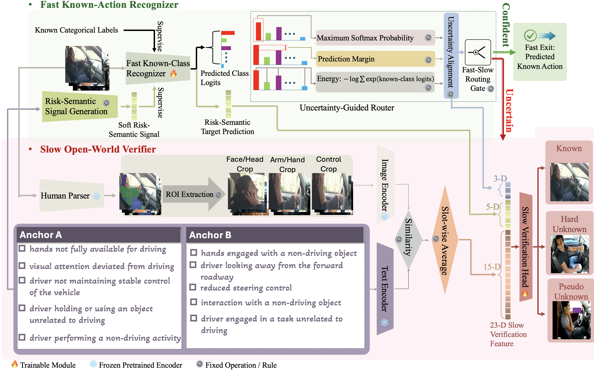

# Beyond Rejection DMS

This repository contains a compact reference implementation of the core method proposed in *Beyond Rejection: Disentangling Semantic and Pseudo Unknowns for Open-World Driver Monitoring*.



Included components:

- risk-semantic definitions and text anchors;
- the MobileNetV2 fast branch;
- uncertainty-score computation;
- risk-region construction;
- local semantic-support computation;
- 23-dimensional evidence composition;
- the three-way slow verifier.

## Demo

```bash
python demo.py
